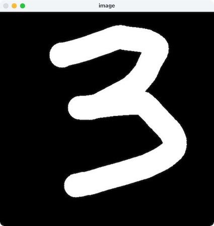

# Handwritten digit recognition based on MNIST

This project uses **PyTorch** to train a convolutional neural network(CNN) to recognize handwritten digits with MNIST as the training set. In addition, this project uses **OpenCV** to write a Drawing board for writing, and the results of writing will be recognized by the convolutional neural network.

## Usage
If you want to experience this program, please download the file locally and execute the following commands in the file directory
```bash
pip install -r requirements.txt     
python main.py //This step is optional because there is a trained model in the directory     
python display.py
```
## Visuals
If the program runs correctly, you will get the following results after performing the above operations:

Drawing board:\


result:\


## Acknowledgement
This project is my introduction to **PyTorch** and **OpenCV**, I mainly refer to the [official PyTorch examples](https://github.com/pytorch/examples).
In these examples, I not only practiced **PyTorch**, but also learned *argparse*, which is very useful on the command line.


